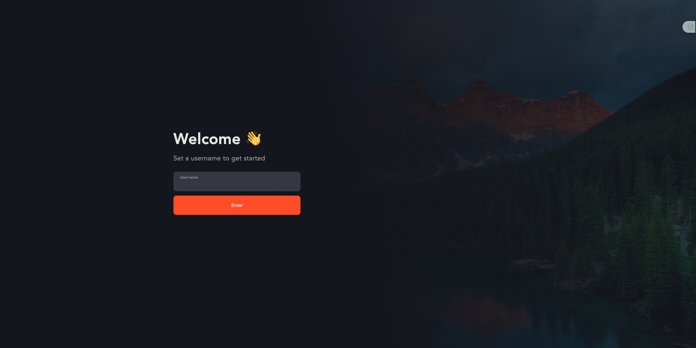
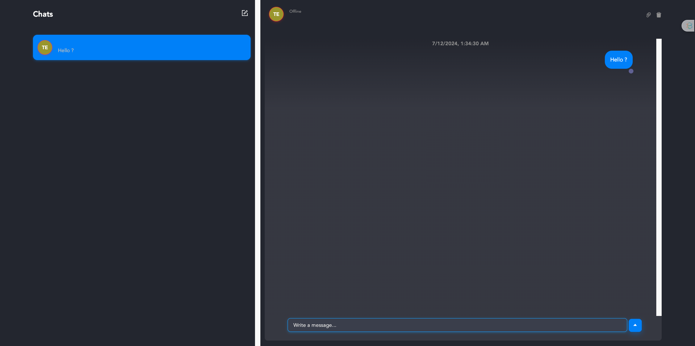

# Chat App with Node.js & React

## Setup

### Prepare your ChatEngine.io account

1. Go to [ChatEngine.io](https://chatengine.io/) and sign up for an account.
2. Go to your dashboard and create a new project [in the project page](https://chatengine.io/projects).
3. Copy the `Project ID` and `Private Key` and keep them safe.

### Prepare your project

1. Download the source code from [this folder in the repository](https://github.com/pkmiya/handson/tree/master/nodejs-reactjs-chat).
2. Open the project in your favorite code editor.

#### Configure the project

1. In `/backend` folder, copy `.env.example` to `.env` and fill in the `CHAT_ENGINE_PRIVATE_KEY` from ChatEngine.io.
2. In `/frontend` folder, copy `.env.example` to `.env` and fill in the `VITE_CHAT_PROJECT_ID` from ChatEngine.io.

#### Install dependencies

1. For both folders `/backend` and `/frontend`, run `npm install`.

## Run the project

1. In `/backend` folder, run `npm start`.
2. In `/frontend` folder, run `npm run dev`.
3. After the project is built, open your browser and go to the development server URL (usually `http://localhost:5173/` for Vite).
4. You should see the chat app running like belows.
5. Type your name and click Enter.
   
6. You can chat with yourself or open another browser and chat with yourself. Enjoy chatting!
   

## Reference

- [YouTube: NodeJS Realtime Chat: Build a FULL-STACK app in 27 Minutes! (Best UI 🤩)](https://youtu.be/Fzv-rgwcFKk?si=B_8A0yNF18Lh-eB1)
- [Official documentation: ChatEngine.io](https://chatengine.io/docs)
- [Official blog: Build a realtime chat app with NodeJS, ReactJS, and ChatEngine.io](https://blog.chatengine.io/fullstack-chat/nodejs-reactjs)
